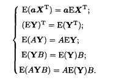

# 补习大数定理！
我嘞个王绍臣你是真不讲第五章啊，相信我们的智慧是吧，相信何教授的智慧是吧，666

# 5.3 多元正态分布
## 多元正态分布定义 

首先我们很数学地扔出一个沟槽的式子：

$$X = \mu + B\varepsilon $$

其中：

1. X是一个n维的列向量
2. $\mu$ 是一个n维常数列向量
3. B是$n\times m$ 矩阵 
4.  $\varepsilon$是一个由n个**相互独立****标准**正态分布的随机变量组成。
   

这个时候我们称X服从n元正态分布，记成$X \sim N(\mu,BB^T )$。

## 协方差矩阵 
哈哈真的什么屎都没学，要了解多元正态分布，我们还需要补一下协方差矩阵的的内容

Y是由随机变量组成的矩阵，有如下的性质:

### 协方差矩阵的定义 
我们现在直接给出协方差矩阵沟槽的定义 

$$\Sigma = E[(X-\mu)(X-\mu)^T] = \sigma_{ij}$$

$$\sigma_{ij}=cov(X_i,X_j)$$

其中 
1. X是随机向量 $X=(X_1,X_2,X_3....X_n)^T$
2. $\mu$ 是随机向量X的期望，即对它每个分量取期望组成的列向量

我们称$\Sigma$是随机向量$X$的 协方差矩阵
    
### 协方差矩阵的性质

协方差矩阵有如下性质:

1. $\Sigma$ 是非负定的
2. $\Sigma$ 退化的充分必要条件是有不全为零的常数$a_1,a_2,....a_n$使得 

$$\sum_{i=1}^n a_i(X_i-\mu_i)=0$$

此时我们称$X_1,X_2...X_n$线性相关

## 多元正态分布性质

现在我们回到多元正态分布，谈论它的性质

   $$E(X)= \mu$$
   $$\Sigma = BB^T$$

